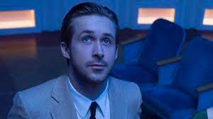
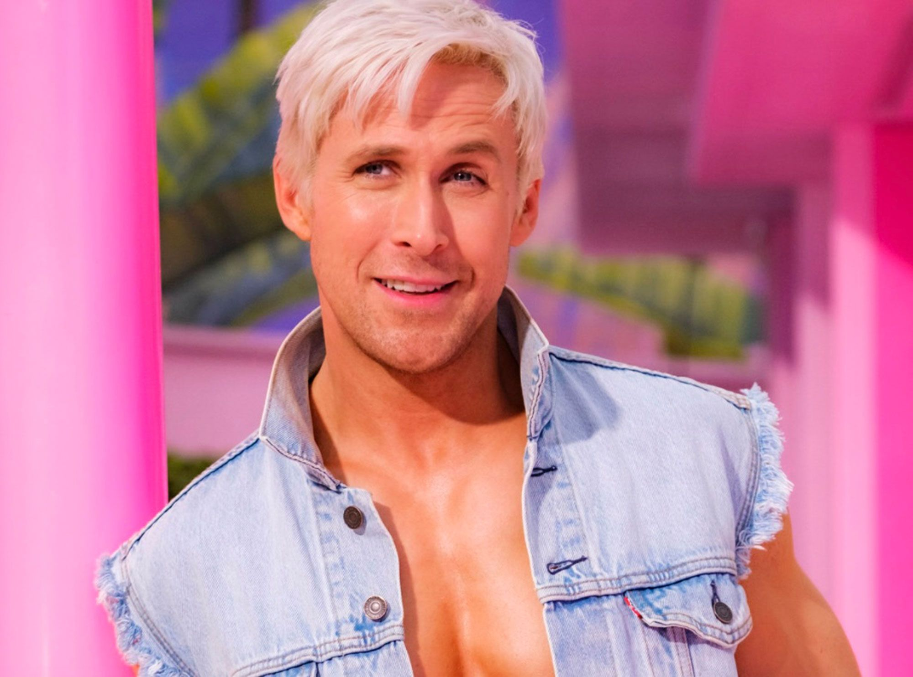
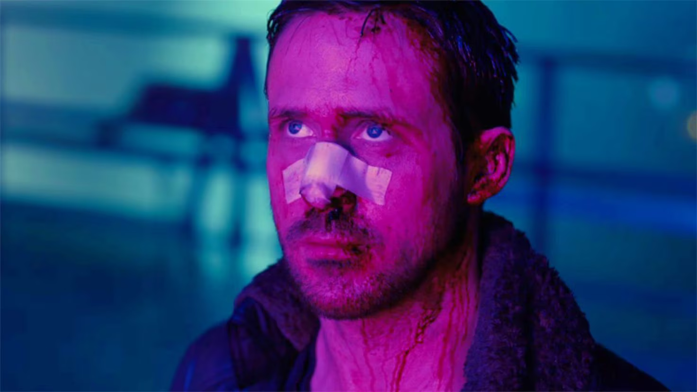
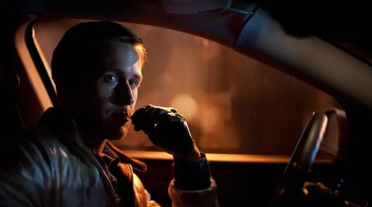

# VC_P4
# Detector de Rostros Ryan Gosling

Este proyecto es un detector de rostros que utiliza técnicas de procesamiento de imágenes para identificar si el rostro en una imagen se asemeja a Ryan Gosling, el apuesto actor de Hollywood.

## Características

- Captura video desde la cámara web en tiempo real.
- Detecta rostros en el video capturado.
- Superpone imágenes de diferentes tipos de Ryan Gosling en tiempo real sobre los rostros detectados.
- Cambia las imágenes de Ryan Gosling cada cierto tiempo, creando una especie de "ruleta de imágenes" con una duración de cambio personalizable.
- Reproduce música relacionada con la imagen de Ryan Gosling actual.
- Permite hacer clic en la ventana para forzar el cambio de imágenes.
- Se puede detener la aplicación presionando la tecla Esc.

Este código combina la detección de rostros en tiempo real con la superposición de imágenes de Ryan Gosling y la reproducción de música, creando una experiencia interactiva. Puedes personalizar las imágenes y la música según tus preferencias.

## Uso

1. Ejecuta el bloque de código que se encuentra a continuación en tu entorno de Jupyter Notebook para iniciar la aplicación.
2. Cuando se abra la ventana de la cámara, colócate de manera que tu cara sea visible en la webcam.
3. Haz clic en el bloque de código y espera a que el algoritmo decida qué tipo de Ryan Gosling eres.
4. ¡Disfruta de tu nueva identidad como Ryan Gosling y de su música!

## Información Adicional

Las imágenes que se encontrarán pertenecen a algunas de las películas en las que Ryan Gosling ha participado.
Las imágenes disponibles y las películas correspondientes en esta aplicación son las siguientes:

- Ryan Gosling en La La Land (2017)

- Ryan Gosling en Barbie (2023)

- Ryan Gosling en Blade Runner 2049 (2017)

- Ryan Gosling en Drive (2011)

## Canciones utilizadas:

- 'City of Stars' (Duet ft. Ryan Gosling, Emma Stone) - La La Land Original Motion Picture Soundtrack
- Kavinsky - Nightcall
- Ryan Gosling - I'm Just Ken (De Barbie: El Álbum)
- you-look-lonely-i-can-fix-that edit
